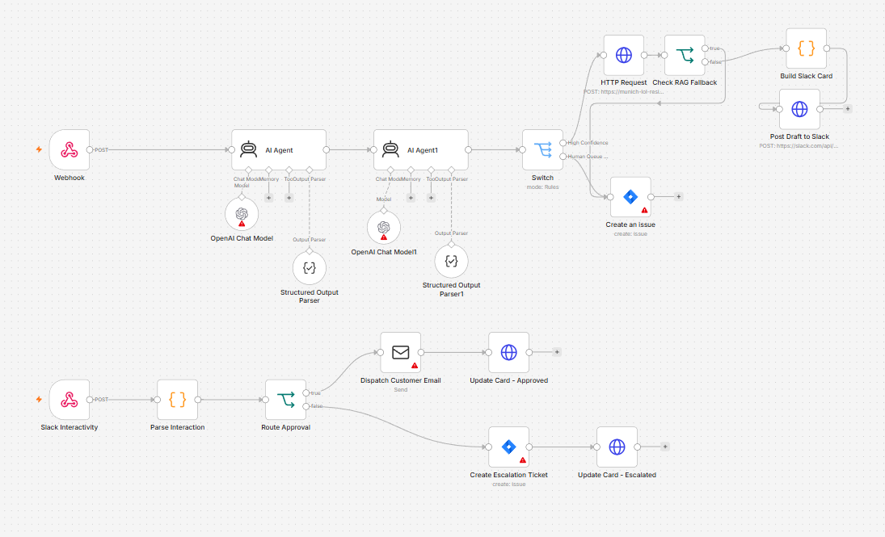
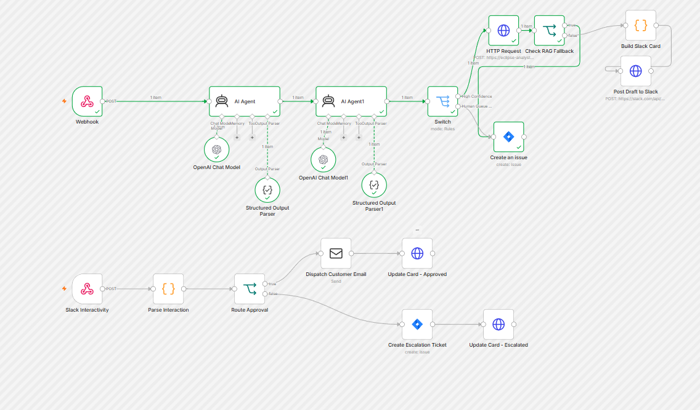

# The Multi-Agent Customer Operations Triage & Auto-Responder





An enterprise-grade, hybrid-deployed customer support automation engine. The system automates email ingestion, performs multi-agent ticket classification/risk assessment, queries a local secure RAG (Retrieval-Augmented Generation) knowledge base, and incorporates a Slack-based Human-in-the-Loop (HITL) review process before final email dispatch.

---

## 📋 Portfolio Repository Architecture Manual

| Phase / Component | Key Configuration File / Location | Tech Stack | Infrastructure / Deployment Layer | Core Role / Function |
| :--- | :--- | :--- | :--- | :--- |
| **1. Ingress & Routing Orchestrator** | [`n8n/CustomerOpsTriageEngine.json`](n8n/CustomerOpsTriageEngine.json) | n8n, Docker, Cloudflare Tunnel | Public Cloud VPS (`hstgr.cloud`) | Receives incoming webhooks, drives the agentic logic, maps Slack buttons, and dispatches SMTP emails. |
| **2. Email Ingress Pull Layer** | [`google_apps_script/forwardGmailToN8n.gs`](google_apps_script/forwardGmailToN8n.gs) | JavaScript, GmailApp API | Google Cloud (Time-driven cron trigger) | Polls Gmail on a schedule, forwards **every** unread inbox message to the n8n `/webhook/triage` endpoint, and marks each read on success. |
| **3. RAG Core API Engine** | [`backend/triage_api/`](backend/triage_api/) | Django, LlamaIndex, PostgreSQL, pgvector | Local Workstation (exposed via Cloudflare Tunnel) | Manages enterprise vector index, matches context queries, and generates auto-response drafts. |
| **4. Local LLM Inference** | [`backend/.env`](backend/.env) (model settings) | Ollama (`gemma4:e2b`) | Local Workstation (exposed via Cloudflare Tunnel) | Generates structured classification, executes risk assessment, and formats support replies. |
| **5. Governance & HITL Approval** | [`Documents/Phase 4.md`](Documents/Phase%204.md) | Slack Block Kit UI, Slack Interactive Webhooks | Slack Cloud / n8n Webhook | Renders draft cards to Slack team channel and captures manual Send/Reject buttons. |
| **6. Escalation Queue** | [`n8n/CustomerOpsTriageEngine.json`](n8n/CustomerOpsTriageEngine.json) | Jira Software API | Jira Cloud Platform | Automatically creates structured Epic/Task tickets for manual engineering review on RAG bypass. |

---

## 🛠️ Hybrid System Architecture Overview

The project is structured around a decoupled **Hybrid Infrastructure Strategy**:
1. **Public Cloud VPS (Ingress & Orchestration)**: Runs an internet-facing dockerized **n8n** instance to handle incoming webhooks, route traffic, format Slack interaction cards, and manage human approval callbacks.
2. **Private Local Workstation (Heavy Computing)**: Hosts a secure **Django Core API**, **LlamaIndex**, and **pgvector** database, with local LLM inference running on **Ollama** (`gemma4:e2b`). This keeps sensitive enterprise data private and eliminates API dependency costs.

---

## 📅 Project Implementation Phases

This project is organized into five technical implementation phases. Click the links below to view the detailed architecture specifications for each phase:

* **[Phase 1: Hybrid Infrastructure Setup](Documents/Phase%201.md)**
  * Details the network topology, cloud VPS deployment with Docker Compose, encrypted Cloudflare reverse tunnels, and core JSON data contracts.
* **[Phase 2: Multi-Agent Routing Engine](Documents/Phase%202.md)**
  * Details the n8n canvas workspace schema, prompt configurations, classification rules (Category, Urgency, Sentiment), and risk filter parameters.
* **[Phase 3: Production-Grade RAG Engine](Documents/Phase%203.md)**
  * Details the local LlamaIndex ingestion pipeline, pgvector database layout, Django API endpoints, and strict system guardrails to prevent hallucinations.
* **[Phase 4: Governance Layer (Slack HITL Integration)](Documents/Phase%204.md)**
  * Details the Slack App workspace configuration, Block Kit interactive message UI, and asynchronous webhook handshakes for human approval.
* **[Phase 5: Closure, Optimization, & Presentation](Documents/Phase%205.md)**
  * Details complete workflow termination via SMTP dispatch, safety fallback paths for insufficient database documentation, and operational test parameters.

---

## 📁 Repository Directory Structure

```plaintext
/The Multi-Agent Customer Operations Triage & Auto-Responder
│
├── /Documents
│   ├── Phase 1.md              # Ingress Orchestration & Network Setup
│   ├── Phase 2.md              # n8n Routing & Agent Prompts
│   ├── Phase 3.md              # Django & LlamaIndex RAG Engine
│   ├── Phase 4.md              # Slack HITL Governance Layer
│   └── Phase 5.md              # Closure, Fallbacks & Presentation
│
├── /backend
│   ├── /backend                # Django configuration & settings
│   ├── /triage_api             # API endpoints, DB seeding, LlamaIndex configuration
│   ├── .env.example            # Environment template file
│   └── manage.py
│
├── /n8n
│   └── CustomerOpsTriageEngine.json # Exported n8n workflow canvas configuration JSON
│
├── /knowledge_base             # Source documents ingested into the RAG vector store
│   ├── billing_faq.txt         # Sample enterprise policy article
│   └── ...                     # account, security, API, troubleshooting samples
│
├── /logs                       # Run logs & smoke-test result artifacts (bootstrap output)
│
├── README.md                   # Master Repository Presentation & Index (This File)
├── requirements.txt            # Pinned Python dependencies
├── N8N_CONFIG.md               # Node-by-node n8n configuration reference
└── pipeline.ps1                # Single script: setup + Ollama + tunnels + run (and -Stop)
```

---

## ⚙️ Quickstart on a Fresh PC (One Command)

> **Portfolio note:** This project is a demonstration system — it is **not meant to run 24/7**. The intended flow is: bring the whole local pipeline up on demand with a single command, let it run a smoke test that proves the RAG engine works, and commit the generated result log in `logs/` as evidence. Bring it up again live only when you want to drive the n8n orchestrator or a Cloudflare tunnel.

### Prerequisites you install yourself (once)
The bootstrap script provisions *everything else*, but these are your responsibility:

1. **Python 3.10+**
2. **Docker Desktop** (used to run the pgvector PostgreSQL database — running, no manual config needed)
3. **Ollama** + the two models. Bootstrap **checks** for these but never installs them:
   ```bash
   ollama serve
   ollama pull gemma4:e2b        # the chat model; must match OLLAMA_LLM_MODEL in backend/.env
   ollama pull nomic-embed-text  # embedding model (must stay 768-dim)
   ```
4. **Gmail + Google Apps Script:** Set up a time-driven script in Google Apps Script to pull unread emails and forward them to your VPS n8n webhook.


### Run it — one script does everything
From the repository root, `pipeline.ps1` handles the **entire** lifecycle: venv, deps,
`.env` + `SECRET_KEY`, pgvector container, migrations, knowledge-base seed, starts Ollama
if needed, starts the Django API, runs a smoke test, opens **both Cloudflare tunnels**
(Django + Ollama), and prints the exact values to paste into n8n.

```powershell
powershell -ExecutionPolicy Bypass -File .\pipeline.ps1
```

| Command | What it does |
| :--- | :--- |
| `.\pipeline.ps1` | Full setup + start everything + open tunnels (port 8520) |
| `.\pipeline.ps1 -Port 8000` | Same, on a different Django port |
| `.\pipeline.ps1 -NoTunnel` | Start locally without opening Cloudflare tunnels |
| `.\pipeline.ps1 -Reseed` | Re-embed the knowledge base before starting |
| `.\pipeline.ps1 -Stop` | Tear down Django + both tunnels + the DB container (Ollama left running) |

When it finishes, it prints a **"UPDATE THESE IN n8n"** block with the two fresh tunnel
URLs — the quick-tunnel hostnames change every run, so re-paste them into the workflow
each time (see next section). A successful `logs/pipeline_result_*.log` records the
smoke-test answer as portfolio proof-of-run.

---

## 🔑 Configurable Environment Variables

The local RAG service is fully parameterized. To ship the project to your GPU-enabled PC, update the following key variables in `backend/.env`:

| Variable Name | Description | Default Value |
| :--- | :--- | :--- |
| `SECRET_KEY` | Django project secret authorization token | `django-insecure-...` |
| `ALLOWED_HOSTS` | Safe server hosts (include your Cloudflare tunnel domain here) | `localhost,127.0.0.1` |
| `DB_NAME` | PostgreSQL database name | `customer_ops` |
| `DB_USER` | PostgreSQL user account | `postgres` |
| `DB_PASSWORD` | PostgreSQL user account password | `local_secure_password123` |
| `DB_HOST` | Database server endpoint | `localhost` |
| `DB_PORT` | Database server connection port | `5432` |
| `OLLAMA_HOST` | Ollama model server URL | `http://localhost:11434` |
| `OLLAMA_LLM_MODEL` | Ollama LLM model tag | `<OLLAMA_LLM_MODEL_NAME_HERE>` |
| `OLLAMA_EMBED_MODEL` | Ollama Text Embedding model tag | `<OLLAMA_EMBED_MODEL_NAME_HERE>` |
| `SLACK_BOT_TOKEN` | Slack app bot integration token | `xoxb-...` |
| `SLACK_APP_ID` | Slack application registration ID | `A0BGPR64K2M` |

> **Note:** The Slack values are consumed by the **n8n orchestrator** (the Governance Layer lives on the VPS), not by the Django backend. They are included in `backend/.env.example` for convenience, but set `SLACK_BOT_TOKEN` in your **n8n instance environment** for the `Post Draft to Slack` node to authenticate. See the *Setting Up n8n Workflow* section below.

---

## ⚙️ Setting Up n8n Workflow

Import `n8n/CustomerOpsTriageEngine.json` into your n8n instance (**Workflows → Import from File**), reconnect credentials, then **toggle the workflow Active** (the production `/webhook/triage` endpoint only registers when Active — activating via the CLI does *not* work). End-to-end shape:

* **Ingress & routing:** `Webhook` → `Valid Ticket` (drops empty payloads) → `AI Agent` (Classifier) → `AI Agent1` (Risk Assessor) → `Switch`.
* **RAG branch (High Confidence):** `HTTP Request` (Django RAG) → `Check RAG Fallback` → `Build Slack Card` → `Post Draft to Slack`; if the RAG returns `ESCALATE_TO_HUMAN` the fallback opens a Jira `Create an issue` instead.
* **Escalation branch (Low Confidence / Risk):** `Create an issue` (Jira).
* **Slack HITL callback (independent trigger):** `Slack Interactivity` → `Parse Interaction` → `Valid Interaction` (drops junk payloads) → `Route Approval` → **approve:** `Dispatch Customer Email` → `Update Card - Approved`; **reject:** `Create Escalation Ticket` (Jira) → `Update Card - Escalated`.

Configure these (consumed by **n8n**, not Django):

| Setting | Where | Value |
| :--- | :--- | :--- |
| `SLACK_BOT_TOKEN` | n8n environment variable | Bot token `xoxb-…` (Bearer auth for `chat.postMessage`). Never paste a raw token into the node — n8n exports it and GitHub blocks the push. |
| SMTP credential | n8n **Credentials** | `Dispatch Customer Email` node |
| Jira credential + Project/Issue Type | the two Jira nodes | `Create an issue` / `Create Escalation Ticket` |
| RAG `HTTP Request` URL | node | your **Django** tunnel `…/api/v1/triage/rag/` |
| Chat model Base URL | `OpenAI Chat Model` nodes | your **Ollama** tunnel `…/v1` |
| Slack Interactivity Request URL | Slack App dashboard | your **VPS n8n** tunnel `…/webhook/slack-interactive` |

> ⚠️ **Do not re-export the workflow back over this file** unless intentional — it reverts repo-side fixes (and can embed secrets). Treat the repo JSON as the source of truth; import it, don't export over it.

> 📋 **See [`N8N_CONFIG.md`](N8N_CONFIG.md)** for the full traffic map (three tunnels), node-by-node values, the VPS port-pinning fix, and the webhook-activation gotcha.

## 📚 Knowledge Base

The `knowledge_base/` folder holds the plain-text source documents that LlamaIndex ingests into the pgvector store. Sample enterprise support content is included (billing, account management, security & privacy, API & integrations, troubleshooting) so the RAG engine returns meaningful answers out of the box. Drop additional `.txt` documents here and re-run the seeder to index them:

```bash
.venv/Scripts/python backend/triage_api/seed_db.py   # Windows
.venv/bin/python backend/triage_api/seed_db.py        # Linux/macOS
```

